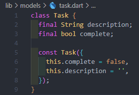
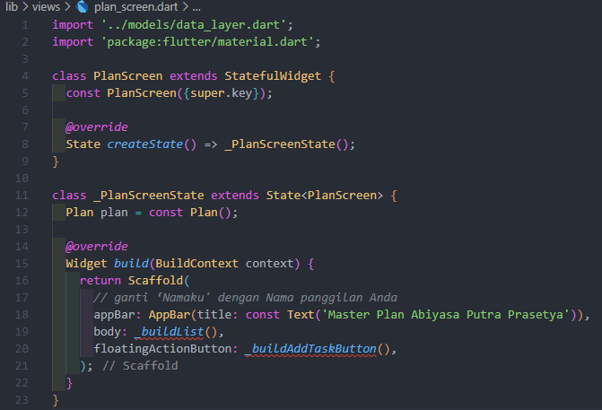

  <h3 align="center">PEMROGRAMAN MOBILE</h3>
  <h3 align="center">Dasar State Management</h3>
  

  <h3 align="center">Tarista Dwi Silvia</h3>
  <h3 align="center">3A - D4TI</h3>
  <h3 align="center">27</h3>
  <h3 align="center">2141720014</h3>

# Praktikum 1: Dasar State dengan Model-View

Langkah 1: Buat Project Baru

Buatlah sebuah project flutter baru dengan nama master_plan di folder src week-11 repository GitHub Anda. Lalu buatlah susunan folder dalam project seperti gambar berikut ini.

  

Langkah 2: Membuat model task.dart

Praktik terbaik untuk memulai adalah pada lapisan data (data layer). Ini akan memberi Anda gambaran yang jelas tentang aplikasi Anda, tanpa masuk ke detail antarmuka pengguna Anda. Di folder model, buat file bernama task.dart dan buat class Task. Class ini memiliki atribut description dengan tipe data String dan complete dengan tipe data Boolean, serta ada konstruktor. Kelas ini akan menyimpan data tugas untuk aplikasi kita. Tambahkan kode berikut:

  

Langkah 3: Buat file plan.dart

Kita juga perlu sebuah List untuk menyimpan daftar rencana dalam aplikasi to-do ini. Buat file plan.dart di dalam folder models dan isi kode seperti berikut.

  

Langkah 4: Buat file data_layer.dart

Kita dapat membungkus beberapa data layer ke dalam sebuah file yang nanti akan mengekspor kedua model tersebut. Dengan begitu, proses impor akan lebih ringkas seiring berkembangnya aplikasi. Buat file bernama data_layer.dart di folder models. Kodenya hanya berisi export seperti berikut.

  

Langkah 5: Pindah ke file main.dart

Ubah isi kode main.dart sebagai berikut.

  

Langkah 6: buat plan_screen.dart

Pada folder views, buatlah sebuah file plan_screen.dart dan gunakan templat StatefulWidget untuk membuat class PlanScreen. Isi kodenya adalah sebagai berikut. Gantilah teks ‘Namaku' dengan nama panggilan Anda pada title AppBar.

  

Langkah 7: buat method _buildAddTaskButton()

Anda akan melihat beberapa error di langkah 6, karena method yang belum dibuat. Ayo kita buat mulai dari yang paling mudah yaitu tombol Tambah Rencana. Tambah kode berikut di bawah method build di dalam class _PlanScreenState.

  

Langkah 8: buat widget _buildList()

Kita akan buat widget berupa List yang dapat dilakukan scroll, yaitu ListView.builder. Buat widget ListView seperti kode berikut ini.

  

Langkah 9: buat widget _buildTaskTile

Dari langkah 8, kita butuh ListTile untuk menampilkan setiap nilai dari plan.tasks. Kita buat dinamis untuk setiap index data, sehingga membuat view menjadi lebih mudah. Tambahkan kode berikut ini.

  

Run atau tekan F5 untuk melihat hasil aplikasi yang Anda telah buat. Capture hasilnya untuk soal praktikum nomor 4.

Langkah 10: Tambah Scroll Controller

Anda dapat menambah tugas sebanyak-banyaknya, menandainya jika sudah beres, dan melakukan scroll jika sudah semakin banyak isinya. Namun, ada salah satu fitur tertentu di iOS perlu kita tambahkan. Ketika keyboard tampil, Anda akan kesulitan untuk mengisi yang paling bawah. Untuk mengatasi itu, Anda dapat menggunakan ScrollController untuk menghapus focus dari semua TextField selama event scroll dilakukan. Pada file plan_screen.dart, tambahkan variabel scroll controller di class State tepat setelah variabel plan.

  

Langkah 11: Tambah Scroll Listener

Tambahkan method initState() setelah deklarasi variabel scrollController seperti kode berikut.

  

Langkah 12: Tambah controller dan keyboard behavior

Tambahkan controller dan keyboard behavior pada ListView di method _buildList seperti kode berikut ini.

  

Langkah 13: Terakhir, tambah method dispose()

Terakhir, tambahkan method dispose() berguna ketika widget sudah tidak digunakan lagi.

  

Tugas Praktikum 1: Dasar State dengan Model-View

1. Jelaskan maksud dari langkah 4 pada praktikum tersebut! Mengapa dilakukan demikian?

Jawab: 

Dengan cara tersebut, kita kemudian dapat mengimpor file data_layer.dart di tempat lain dalam proyek tanpa harus secara langsung mengimpor plan.dart dan task.dart. Ini membuat pengelolaan impor lebih terstruktur dan lebih mudah dikelola saat proyek Anda tumbuh dan berkembang.

2. Mengapa perlu variabel plan di langkah 6 pada praktikum tersebut? Mengapa dibuat konstanta ?

Jawab:

Variabel plan adalah tempat penyimpanan rencana yang ingin ditampilkan. Jika rencananya tidak akan berubah, kita gunakan const Plan() agar nilainya tetap sama. Jika rencananya bisa berubah, kita gunakan Plan plan = Plan() supaya bisa diubah sesuai kebutuhan.

3. Lakukan capture hasil dari Langkah 9 berupa GIF, kemudian jelaskan apa yang telah Anda buat!

Jawab:

Ini adalah kode yang lebih ringkas yang menggunakan metode _updateTask untuk memperbarui tugas. Saat Checkbox atau TextFormField berubah, onChanged memanggil _updateTask untuk melakukan perubahan pada plan dengan tugas yang diperbarui. Hal ini membantu mengurangi duplikasi kode karena logika pembaruan tugas dipindahkan ke dalam satu fungsi.

4. Apa kegunaan method pada Langkah 11 dan 13 dalam lifecyle state ?

Jawab:

initState() digunakan saat widget pertama kali dibuat untuk melakukan pengaturan awal, seperti membuat ScrollController dan menambahkan listener agar fokus berperilaku dengan benar saat pengguna menggulir.

Sementara dispose() digunakan ketika widget tidak lagi diperlukan. Di dalamnya, kita membersihkan atau melepaskan sumber daya yang sudah tidak dibutuhkan, seperti membuang ScrollController agar tidak memakan memori ketika widget sudah tidak ada lagi.

# Praktikum 2: Mengelola Data Layer dengan InheritedWidget dan InheritedNotifier

Langkah 1: Buat file plan_provider.dart

Buat folder baru provider di dalam folder lib, lalu buat file baru dengan nama plan_provider.dart berisi kode seperti berikut.

  

Langkah 2: Edit main.dart

Gantilah pada bagian atribut home dengan PlanProvider seperti berikut. Jangan lupa sesuaikan bagian impor jika dibutuhkan.

  

Langkah 3: Tambah method pada model plan.dart

Tambahkan dua method di dalam model class Plan seperti kode berikut.

  

Langkah 4: Pindah ke PlanScreen

Edit PlanScreen agar menggunakan data dari PlanProvider. Hapus deklarasi variabel plan (ini akan membuat error). Kita akan perbaiki pada langkah 5 berikut ini.

Langkah 5: Edit method _buildAddTaskButton

Tambahkan BuildContext sebagai parameter dan gunakan PlanProvider sebagai sumber datanya. Edit bagian kode seperti berikut.

  

Langkah 6: Edit method _buildTaskTile

Tambahkan parameter BuildContext, gunakan PlanProvider sebagai sumber data. Ganti TextField menjadi TextFormField untuk membuat inisial data provider menjadi lebih mudah.

  

Langkah 7: Edit _buildList

Sesuaikan parameter pada bagian _buildTaskTile seperti kode berikut.

  

Langkah 8: Tetap di class PlanScreen

Edit method build sehingga bisa tampil progress pada bagian bawah (footer). Caranya, bungkus (wrap) _buildList dengan widget Expanded dan masukkan ke dalam widget Column seperti kode pada Langkah 9.

Langkah 9: Tambah widget SafeArea

Terakhir, tambahkan widget SafeArea dengan berisi completenessMessage pada akhir widget Column. Perhatikan kode berikut ini.

  

Akhirnya, run atau tekan F5 jika aplikasi belum running. Tidak akan terlihat perubahan pada UI, namun dengan melakukan langkah-langkah di atas, Anda telah menerapkan cara memisahkan dengan baik antara view dan model. Ini merupakan hal terpenting dalam mengelola state di aplikasi Anda.

  

# Tugas Praktikum 2: InheritedWidget

1. Jelaskan mana yang dimaksud InheritedWidget pada langkah 1 tersebut! Mengapa yang digunakan InheritedNotifier?

Jawab:

InheritedWidget adalah cara Flutter untuk berbagi data antar-widget. Dalam kasus ini, PlanProvider adalah jenis khusus dari InheritedWidget yang menyediakan ValueNotifier<Plan>. ValueNotifier memungkinkan data Plan untuk diubah dan diberitahukan kepada widget-widget di bawahnya saat ada perubahan.

Jadi, PlanProvider digunakan untuk mengirim dan memperbarui informasi tentang Plan ke widget-widget di dalam aplikasi kita. Ketika Plan berubah, widget-widget yang menggunakan PlanProvider akan terinformasikan dan diperbarui sesuai. Hal ini memungkinkan penggunaan data Plan tanpa harus mengubah langsung struktur widget.

2. Jelaskan maksud dari method di langkah 3 pada praktikum tersebut! Mengapa dilakukan demikian?

Jawab:

Dua method yang ditambahkan ke dalam model Plan memberikan informasi tentang kemajuan dari daftar tugas. completedCount menghitung jumlah tugas yang sudah selesai, sedangkan completenessMessage memberikan pesan tentang seberapa banyak tugas yang sudah selesai dari total tugas yang ada. Dengan begitu, pengguna dapat melihat seberapa banyak tugas yang telah diselesaikan dari totalnya.

3. Lakukan capture hasil dari Langkah 9 berupa GIF, kemudian jelaskan apa yang telah Anda buat!

Jawab:

  

Kode tersebut membuat tampilan dengan daftar tugas yang bisa di-scroll (dalam ListView.builder). Di bagian bawah layar, ada teks yang menunjukkan berapa banyak tugas yang sudah selesai dari totalnya. Ini membantu pengguna melihat progres yang telah mereka capai dalam mengerjakan tugas-tugas mereka.

# Praktikum 3: Membuat State di Multiple Screens

Langkah 1: Edit PlanProvider

Perhatikan kode berikut, edit class PlanProvider sehingga dapat menangani List Plan.

  

Langkah 2: Edit main.dart

Langkah sebelumnya dapat menyebabkan error pada main.dart dan plan_screen.dart. Pada method build, gantilah menjadi kode seperti ini.

  

Langkah 3: Edit plan_screen.dart

Tambahkan variabel plan dan atribut pada constructor-nya seperti berikut.

  

Langkah 4: Error

Itu akan terjadi error setiap kali memanggil PlanProvider.of(context). Itu terjadi karena screen saat ini hanya menerima tugas-tugas untuk satu kelompok Plan, tapi sekarang PlanProvider menjadi list dari objek plan tersebut.

Langkah 5: Tambah getter Plan

Tambahkan getter pada _PlanScreenState seperti kode berikut.

  

Langkah 6: Method initState()

Pada bagian ini kode tetap seperti berikut.

  

Langkah 7: Widget build

Pastikan Anda telah merubah ke List dan mengubah nilai pada currentPlan seperti kode berikut ini.

  

Langkah 8: Edit _buildTaskTile

Pastikan ubah ke List dan variabel planNotifier seperti kode berikut ini.

  

Langkah 9: Buat screen baru

Pada folder view, buatlah file baru dengan nama plan_creator_screen.dart dan deklarasikan dengan StatefulWidget bernama PlanCreatorScreen. Gantilah di main.dart pada atribut home menjadi seperti berikut.

  

  

Langkah 10: Pindah ke class _PlanCreatorScreenState

Kita perlu tambahkan variabel TextEditingController sehingga bisa membuat TextField sederhana untuk menambah Plan baru. Jangan lupa tambahkan dispose ketika widget unmounted seperti kode berikut.

  

Langkah 11: Pindah ke method build

Letakkan method Widget build berikut di atas void dispose. Gantilah ‘Namaku' dengan nama panggilan Anda.

  

Langkah 12: Buat widget _buildListCreator

Buatlah widget berikut setelah widget build.

  

Langkah 13: Buat void addPlan()

Tambahkan method berikut untuk menerima inputan dari user berupa text plan.

  

Langkah 14: Buat widget _buildMasterPlans()

Tambahkan widget seperti kode berikut.

  

Terakhir, run atau tekan F5 untuk melihat hasilnya jika memang belum running. Bisa juga lakukan hot restart jika aplikasi sudah running. Maka hasilnya akan seperti gambar berikut ini.

# Tugas Praktikum 3: State di Multiple Screens

1. Berdasarkan Praktikum 3 yang telah Anda lakukan, jelaskan maksud dari gambar diagram berikut ini!

  

Jawab:

Diagram tersebut menunjukkan struktur dasar dari aplikasi material Flutter. Struktur tersebut terdiri dari beberapa komponen utama, yaitu:

-  MaterialApp: Komponen ini adalah komponen induk dari aplikasi material. Komponen ini      menyediakan pengaturan dasar untuk aplikasi, seperti tema, warna, dan font.

-  PlanProvider: Komponen ini menyediakan data rencana.

-  PlanScreen: Komponen ini menampilkan layar utama aplikasi. Layar ini menampilkan daftar rencana.

-  PlanCreatorScreen: Komponen ini menampilkan layar pembuat rencana. Layar ini digunakan untuk membuat rencana baru.

Diagram tersebut menunjukkan bagaimana komponen-komponen tersebut saling berinteraksi. Berikut adalah penjelasannya:

-  MaterialApp: Komponen ini menyediakan pengaturan dasar untuk aplikasi. Komponen ini juga menyediakan rute untuk layar utama aplikasi.

-  PlanProvider: Komponen ini menyediakan data rencana. Komponen ini diinisialisasi di layar utama aplikasi.

-  PlanScreen: Komponen ini menampilkan daftar rencana. Komponen ini mengambil data rencana dari komponen PlanProvider.

-  PlanCreatorScreen: Komponen ini menampilkan layar pembuat rencana. Komponen ini menggunakan rute yang disediakan oleh komponen MaterialApp.

2. Lakukan capture hasil dari Langkah 14 berupa GIF, kemudian jelaskan apa yang telah Anda buat!

Jawab: 

  

Pertama, ia memeriksa apakah pengguna memiliki rencana yang sudah dibuat. Jika tidak ada rencana, tampilannya menunjukkan pesan bahwa belum ada rencana yang tersedia. Namun, jika ada rencana, aplikasi akan menampilkan daftar rencana dalam bentuk kotak-kotak kecil yang berisi informasi seperti nama rencana dan pesan singkat tentang kemajuan rencana tersebut. Ketika pengguna mengetuk salah satu rencana, mereka akan melihat detail dari rencana yang dipilih. Jadi, secara keseluruhan, kode ini bertanggung jawab untuk menampilkan daftar rencana kepada pengguna, memungkinkan mereka untuk melihat detail rencana yang sudah dibuat.